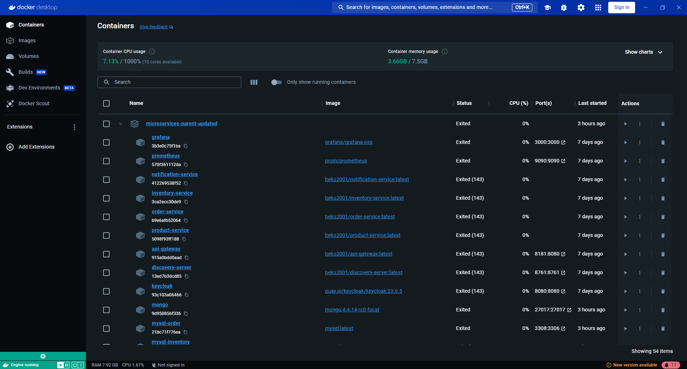
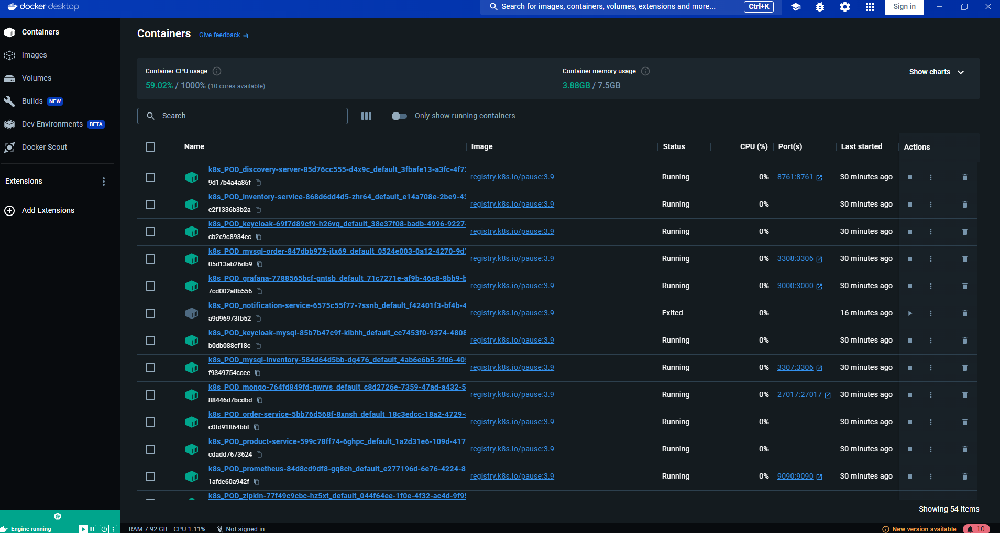
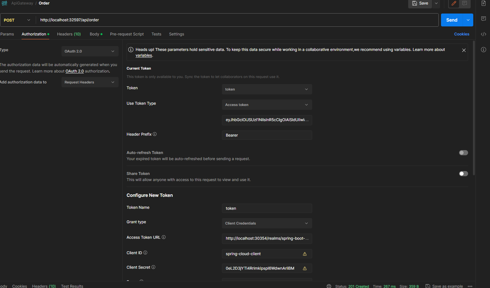
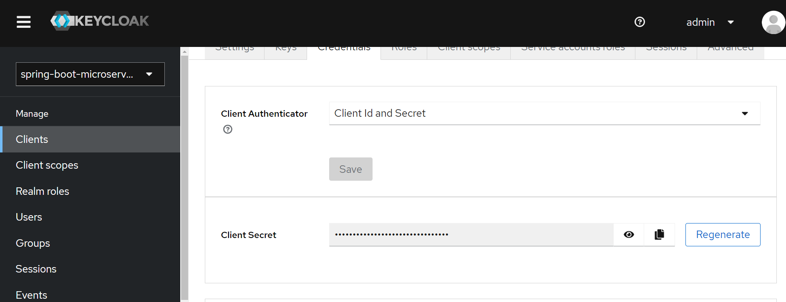
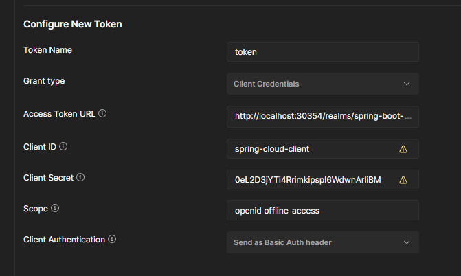
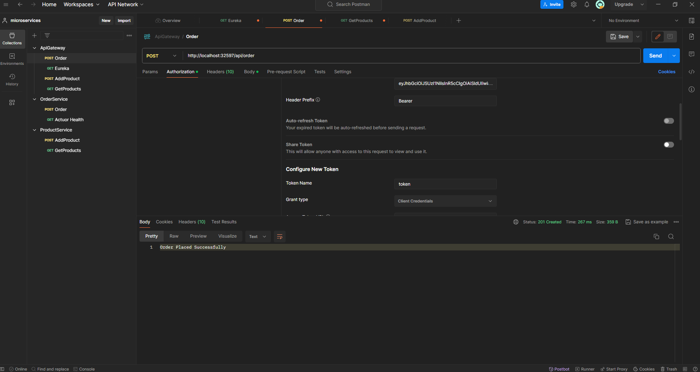

# Spring-Boot-Microservices-Project-Docker-and-Kubernetes

This is a repository containing Docker and Kubernetes files and configurations for a microservices project.

Java Spring Microservices Project [Java Spring Microservices Project]( https://github.com/Berko01/Spring-Boot-Microservice-Project)


If you want to learn more about Docker and Kubernetes, you can check out my article on Docker;

Docker Article [My Article](https://medium.com/@berkindundar2001/docker-nedir-neden-kullan%C4%B1l%C4%B1r-neden-%C3%B6nemlidir-f7a5c8583f2c)


Feel free to ask if you have any further questions or need additional information!


## Project Images and Components

Docker Containers


Kubernetes Pods:



  
## Features

- Docker and Kubernetes
- Docker Compose configurations.
- Kubernetes configurations.


  
## Distribution

Docker Installation:
First, download and install Docker. You can install Docker for Windows or Mac using the Docker Desktop application. You can download the appropriate Docker Desktop version for your operating system from the Docker website.
WSL (Windows Subsystem for Linux) Installation:
Search for "Turn Windows features on or off" in the Start menu and open it.
In the window that opens, check the "Windows Subsystem for Linux" option and click "OK" to save the changes.
Restart your computer for the changes to take effect.

Running the Files:

For Docker:
Navigate to the directory where the files are located.
Open a terminal or command prompt and run the command . This command will start the Docker Compose files.
```terminal
  docker-compose up
```
For Kubernetes:
Navigate to the directory where the files are located.
Switch to WSL by typing "bash".
Run the command kubectl apply -f . to deploy all pods.
```bash
  kubectl apply -f .
```

For Service informations:
```bash
  kubectl get services
```
After running kubectl get services, you will see a list of ports forwarded to your computer. Please make sure you use the correct ports in Postman.


For Pod Informations:
```bash
  kubectl get pods
```

Postman Configurations

Select Authorization type as OAuth 2.0:


Configure New Token:

First, using the command where you obtained the port information, navigate to "localhost:PORT" (replace PORT with the Keycloak port number) in your browser. Then, select "spring-boot-microservices" as the Realm. Proceed to the "Client" section and choose "spring-cloud-client" from the list. Navigate to the "Credentials" section and copy the "Client Secret":


Use your client secret:


You are ready to go!


  
## Technologies

**Language:** Bash / Shell Scripting / 

**Technologies:** - Docker and Kubernetes
  
## Related projects

You can take a look at the Microservices Project:

Java Spring Microservices Project [Java Spring Microservices Project]( https://github.com/Berko01/Spring-Boot-Microservice-Project)


  
## Extracted Lessons

Important lessons have been learned about Docker and Kubernetes.

Firstly, significant gains have been made in areas such as Docker Compose, Kubernetes Deployment, Kubernetes Services, and Kubernetes Persistent Volumes. Understanding how to create files for these tools has been achieved.

Additionally, important insights have been gained regarding the configuration of microservices at the container and pod level.

Understanding the relationships between pod and container ports has been achieved.

Furthermore, important insights have been gained regarding Kubernetes networks.
  
## Programmers

- [@Berko01](https://github.com/Berko01) development.

  
## Tests

Postman Tests
